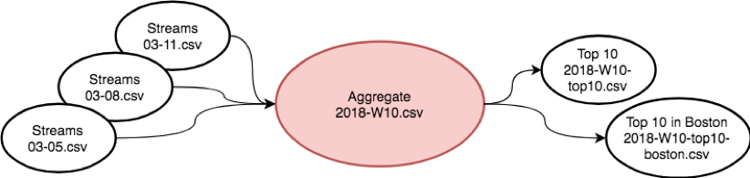
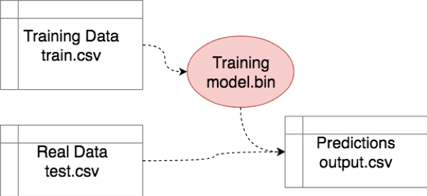
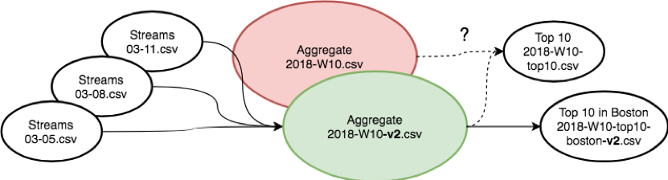
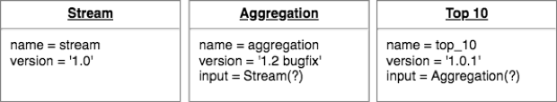
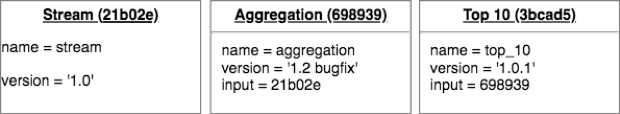
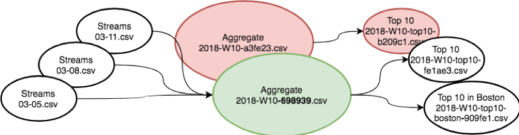

## Salted Graphs – a (Delicious) Approach to Repeatable Data Science

Data Science is easy* when your data fit in memory, your functions are
stateless, and everything is version controlled.  As things grow, however, the
data pipeline can become its own tangled mess – if you change a preprocessing
step, does your model need to be retrained?  What about predictions – did you
rerun them after finding the best parameters for the model?  Which teammates
have which versions of your output?

### The Problem – Data Dependency Hell

Developers have juggled “Dependency Hell” issues for decades, and many tools
exist to help keep our environments functional and complete.  Yet there are few
or no standard tools for the artifacts of a data science workflow, or even
outputs from an ETL pipeline.  Functions are expected to get “the most recent”
input and we rely on eventual consistency, despite the obvious risks and
prevalent failures.

Imagine a workflow where raw data – perhaps log events, or streaming records
from a music, video, or ad server, are collected by day into individual
partition files.  An aggregator collects them, and maybe counts by artist for
the week.  Downstream reports may filter to the Top 10, or Top 10 by some
criteria – within a genre, or artists in Boston:

If the data is small enough, perhaps the aggregation output lives in a
relational database and the Top 10 views are dynamic queries when you load your
favorite BI tool.  However, if we rely on those Top 10 lists to be persisted
data in some storage system, then we are assuming they are correct in
perpetuity.  What’s the worst that can happen? Finding a bug in the aggregation
task!

If the aggregation task needs to be rerun, we have no principled way of knowing
which downstream artifacts were created with the bad data as input.  We could
delete them all, or accept errors in the results (after all, next week’s output
should be fine).  Neither option is particularly exciting.

The scenario is identical, with more subtle impact, if your ‘aggregation’ task
is the result of a machine learning routine, but you’ve made significant
improvement in the underlying model.  Do you trust the outputs in all the
downstream results?  We also see the issue if two developers are working
simultaneously on different inputs to a common downstream task – such as a
pretraining data transformation and model training procedure.  If they are
working on separate code branches, downstream prediction outputs may reflect
updates in one step but not another – we have no way of ensuring the predictions
are rerun when both code changes are finally merged.

We can make a slight improvement by ‘versioning’ the data output – new
aggregations can be written to a new file, appropriately named ‘v2,’ but this
gets complicated downstream.  Does every task need to know about the aggregation
changes, and be rewritten to output to a new file?  We can trace the file output
in the aggregation task to a code change, but we may not know which input was
used for any downstream task unless we modify every single one of them manually.

### The DAG – a new way of thinking

A better solution exists, of course.  A workflow such as the above can be
thought of as a graph – a Directed Acyclic Graph, or
[DAG](https://en.wikipedia.org/wiki/Directed_acyclic_graph), to be formal –
which is basically a way of representing which tasks depend on which others for
input.  If we represent our program as a graph, we can write functions that
*operate on the graph directly*, and leverage a whole new set of tricks to solve
problems like these.

[Luigi](http://luigi.readthedocs.io/en/stable/) is a popular framework in Python
for writing “Tasks” that can be represented in a DAG.  Each step in the workflow
is a Task, which may ‘require’ other tasks as its input – the task is a node in
the DAG, and the task requirements are edges.  In this framework we can now
repose our question:

> Can we write a task output in such a way that its filename – or the ‘version’
> of the data in some storage system – is unique for the entire lineage of tasks
> and versions used to create it?  Can we guarantee that any changes in the
> lineage of a task will result in a new data version that we do not see on disk
> until the task is rerun?

Instead of ‘version controlling’ our code or data, we are now in the space of
‘controlling the version’ of the output!  If we can come up with a versioning
scheme for our data, we can solve the data dependency issue by requiring task
outputs to capture the lineage of the data they were run on: when we read back
the output, our code will only look for the exact version it knows to be
correct.

### The Solution – A Salted Graph

There are, of course, many ways to accomplish this objective.  Here I will
explain one that we use in Solaria Labs, which has the benefits of being
portable and not requiring any central system or database to coordinate the
changes – that is, the data lineage and version can be determined entirely from
within the codebase the workflow is written in.

Imagine the graph as a set of ‘documents’ that capture the name of each task,
and perhaps some other data.  We already know we want to version each task
somehow – a new version of the task should result in all the downstream outputs,
including its own, to be updated to new data versions (note: the task version is
not necessarily the same as the data version!).  We also want to include the
graph edges – our task requirements, including their expected data versions – in
the documents.  Our documents may look like this:

Let’s focus on the ‘Stream’ task first, since (as we’ve designed it) it has no
inputs.  We have indicated that the task version is ‘1.0,’ but we don’t need to
use this as a data version.  Instead, we can simply hash the document!

A [hash](https://en.wikipedia.org/wiki/Cryptographic_hash_function) is a
function which takes an arbitrary bit of data, like our task document, and
returns a very large pseudo-random number (usually written as a hexadecimal
code, e.g. 21b02e) which can be thought of as the signature, or digest, of the
data.  It is virtually impossible for two chunks of data to have the same hash –
small changes in the data will result in completely different hashes – and the
same data hashed twice will always have the same signature.  These properties
have made message hashing extremely useful in software like Bitcoin and, in
fact, [Git](https://git-scm.com/book/en/v1/Git-Internals).

The simple trick now is to use a hash of each document as the data version – and
as the pointer in the downstream tasks! The resulting task ids and documents now
look like:

Whenever a task version changes, it will alter the hashed id of the document.
Critically, the next downstream task will now have a new pseudo-random number
which will impact its own hash – and the effect will trickle all the way down.
Because the hash is sensitive to the smallest of changes in its input data, we
have created a unique data version which universally identifies the artifact
from the task.  Adding these versions and pseudorandom numbers into the data
with the explicit aim to change the resulting hashed value is similar to the
notion of a salt in cryptography, and hence, we can refer to our DAG of data
dependencies as a ‘Salted Graph.’

Simply writing the data version into a filename – or key for a key value store,
a version column in a relational database, etc. – now yields the deterministic
relationship between all the data artifacts.  If we need to update any task in
the chain, we can simply do so by tweaking its version – and our code will know
to recreate all absent downstream results the next time we ask for them.

### Tying it Together – A Working Example

An example solution which implements a generic function, `get_salted_version`,
for a Luigi task, is shown below.  Some example workable tasks are included –
they just need some fake data to read!  Create a few tsv files in
`data/stream/YYYY-MM-DD.tsv` with a column named ‘artist’ and run the code via
luigi.

See: [salted_demo.py](salted_demo.py)
